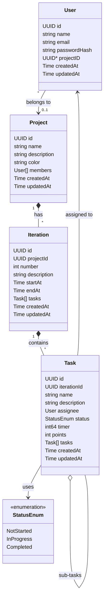
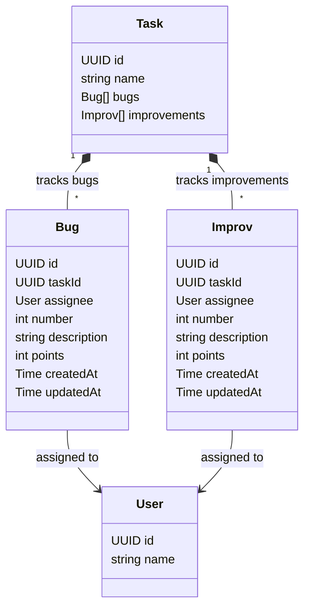
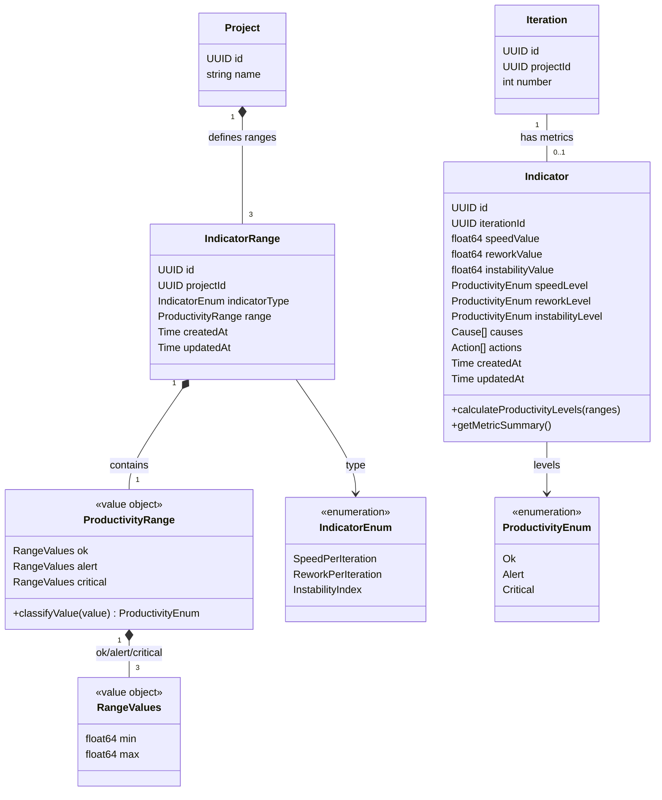
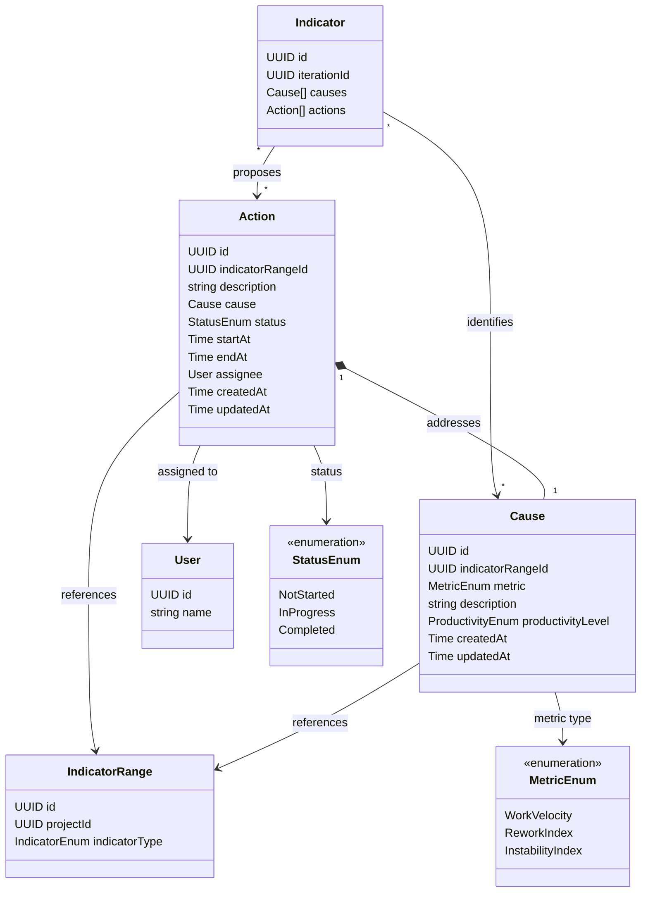
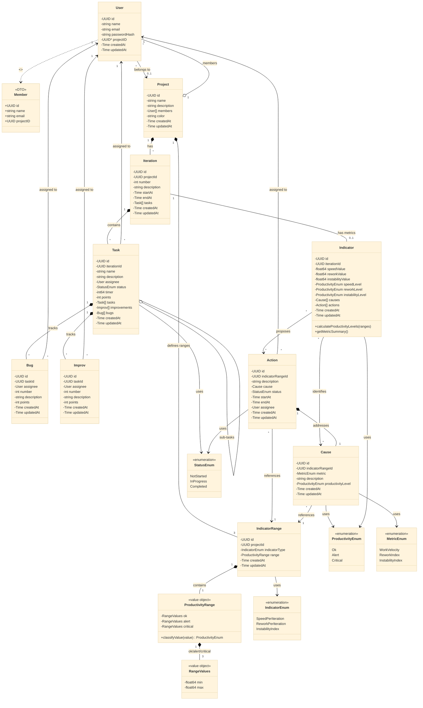

# Prodyo Backend - Architecture

This document describes the architecture and database schema of the Prodyo Backend API.

## Table of Contents

- [Overview](#overview)
- [Architecture Layers](#architecture-layers)
- [Database Schema](#database-schema)
  - [Core Domain](#core-domain)
  - [Quality Tracking](#quality-tracking)
  - [Productivity Metrics](#productivity-metrics)
  - [Improvement Actions](#improvement-actions)
  - [Complete Entity Relationship Diagram](#complete-entity-relationship-diagram)
- [Key Concepts](#key-concepts)
- [Data Flow](#data-flow)

## Overview

Prodyo is a productivity management system for software development teams. It tracks iterations, tasks, and automatically calculates productivity metrics (speed, rework, instability) to help teams identify issues and plan improvements.

## Architecture Layers

The application follows a **Clean Architecture** pattern with clear separation of concerns:

```
┌─────────────────────────────────────────┐
│           HTTP Handlers                 │  ← REST API endpoints
├─────────────────────────────────────────┤
│            Use Cases                    │  ← Business logic
├─────────────────────────────────────────┤
│          Repositories                   │  ← Data access layer
├─────────────────────────────────────────┤
│        Domain Models                    │  ← Entities & value objects
├─────────────────────────────────────────┤
│           Database                      │  ← PostgreSQL
└─────────────────────────────────────────┘
```

### Layer Responsibilities

- **Handlers** (`cmd/internal/handlers/`): HTTP request/response handling, input validation, JSON marshaling
- **Use Cases** (`cmd/internal/usecases/`): Business logic, orchestration of repositories and services
- **Services** (`cmd/internal/services/`): Specialized business logic (e.g., indicator calculation)
- **Repositories** (`cmd/internal/repositories/`): Database queries, CRUD operations
- **Models** (`cmd/internal/models/`): Domain entities, value objects, enums

## Database Schema

### Core Domain

The core domain manages projects, users, iterations, and tasks.



**Relationships:**
- A **User** can belong to one **Project** (optional)
- A **Project** has many **Users** as members
- A **Project** contains many **Iterations**
- An **Iteration** contains many **Tasks**
- A **Task** can have many sub-**Tasks** (recursive relationship)
- **Tasks** are assigned to **Users**

### Quality Tracking

Quality issues (bugs and improvements) are tracked per task.



**Relationships:**
- A **Task** can have many **Bugs** (quality issues requiring rework)
- A **Task** can have many **Improvements** (enhancement requests)
- **Bugs** and **Improvements** are assigned to **Users**

**Impact on Metrics:**
- Bug count affects the **Rework** indicator
- Improvement count affects the **Instability** indicator

### Productivity Metrics

Productivity metrics are calculated per iteration and classified using project-level ranges.



**How It Works:**

1. Each **Project** has 3 **IndicatorRanges** (one for each metric: Speed, Rework, Instability)
2. Each **IndicatorRange** defines a **ProductivityRange** with Ok/Alert/Critical thresholds
3. Each **Iteration** has one **Indicator** with calculated metric values
4. Metric values are classified into productivity levels (Ok/Alert/Critical) using the project's ranges

**Metric Calculations:**

- **Speed**: `tasks_completed / duration_in_days`
- **Rework**: `bug_count / task_count`
- **Instability**: `improvement_count / task_count`

### Improvement Actions

When metrics indicate issues, teams can create causes and actions for improvement.



**Workflow:**

1. An **Indicator** identifies productivity issues (Alert/Critical levels)
2. Teams create **Causes** to explain why metrics are poor
3. Teams create **Actions** to address specific **Causes**
4. **Actions** are assigned to **Users** and tracked to completion

**Relationships:**
- A **Cause** is linked to an **IndicatorRange** (which metric it affects)
- An **Action** addresses one **Cause**
- An **Action** is assigned to a **User**
- Multiple **Actions** can address the same **Cause**

### Complete Entity Relationship Diagram

<details>
<summary>Click to expand complete ERD</summary>



</details>

## Key Concepts

### Entities

| Entity | Description |
|--------|-------------|
| **User** | System users who can be assigned to projects and tasks |
| **Member** | DTO (Data Transfer Object) - public view of User without sensitive data |
| **Project** | Container for iterations, tasks, and team members |
| **Iteration** | Time-boxed development cycle (e.g., sprint, milestone) |
| **Task** | Work item within an iteration, can have sub-tasks |
| **Bug** | Quality issue tracked per task (affects rework metric) |
| **Improv** | Improvement request tracked per task (affects instability metric) |
| **Indicator** | Calculated productivity metrics for an iteration |
| **IndicatorRange** | Project-level thresholds for classifying metrics |
| **Cause** | Root cause analysis for low productivity |
| **Action** | Improvement action to address a cause |

### Value Objects

| Value Object | Description |
|--------------|-------------|
| **ProductivityRange** | Contains Ok/Alert/Critical thresholds for a metric |
| **RangeValues** | Min/max values defining a range |

### Enumerations

| Enum | Values | Usage |
|------|--------|-------|
| **StatusEnum** | NotStarted, InProgress, Completed | Task and Action status |
| **ProductivityEnum** | Ok, Alert, Critical | Metric classification levels |
| **MetricEnum** | WorkVelocity, ReworkIndex, InstabilityIndex | Legacy metric types (Cause) |
| **IndicatorEnum** | SpeedPerIteration, ReworkPerIteration, InstabilityIndex | Current indicator types |

### Design Patterns

#### DTO Pattern (Member)

**Member** is a Data Transfer Object that provides a sanitized view of **User**:
- Excludes sensitive data (`passwordHash`)
- Excludes timestamp fields (`createdAt`, `updatedAt`)
- Used in API responses to external consumers
- Converted from User via `User.ToMember()` method

#### Value Object Pattern (ProductivityRange)

**ProductivityRange** is an immutable value object that:
- Encapsulates business logic for classifying metric values
- Has no identity (compared by value, not ID)
- Contains the `ClassifyValue()` method for determining productivity levels

## Data Flow

### Metric Calculation Flow

```
1. Tasks created in Iteration
   ↓
2. Bugs and Improvements tracked per Task
   ↓
3. Iteration completes
   ↓
4. Indicator values calculated:
   - Speed = completed_tasks / duration_days
   - Rework = bug_count / task_count
   - Instability = improvement_count / task_count
   ↓
5. Indicator levels determined using Project's IndicatorRanges
   ↓
6. If Alert/Critical → Teams create Causes and Actions
```

### Action Planning Flow

```
1. Indicator shows Alert/Critical level for a metric
   ↓
2. Team identifies Cause (why is productivity low?)
   - Linked to specific IndicatorRange
   - Describes root cause
   ↓
3. Team creates Action(s) to address Cause
   - Assigned to User
   - Tracked with StatusEnum (NotStarted → InProgress → Completed)
   ↓
4. Actions completed over time
   ↓
5. Future iterations show improved metrics
```

## Database Migrations

Migrations are located in `cmd/internal/migrations/` and run automatically on application startup. The migration system ensures:

- Schema versioning and consistency
- Automatic table creation
- Safe upgrades without data loss

## Additional Notes

- All entities use **UUID** as primary keys for distributed system compatibility
- Timestamps (`createdAt`, `updatedAt`) are tracked on all entities
- **Soft deletes** are not implemented - deletions are permanent
- **Concurrency control** is not implemented at the application layer (relies on database transactions)
