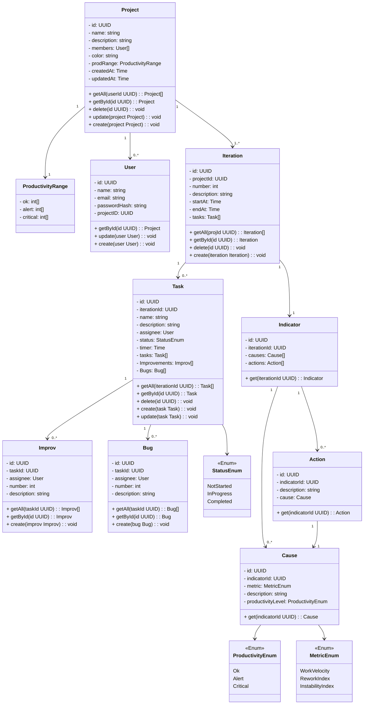

# Prodyo Backend API
## Features

- **Project Management**: Create, read, update, and delete projects with team members
- **Iteration Tracking**: Manage development iterations with tasks and metrics
- **Productivity Metrics**: Track speed, rework, and instability indicators
- **Quality Tracking**: Monitor bugs and improvements per task
- **Action Planning**: Create causes and actions based on productivity analysis
- **Iteration analysis**: Generate iteration analysis based on indicators ranges and iteration performance
- **Automatic Migrations**: Database migrations run automatically on startup
- **Docker Support**: Easy deployment with Docker Compose

## Quick Start

### Prerequisites

- Go 1.21 or higher
- PostgreSQL 14+
- Docker & Docker Compose (optional)

### Running with Docker

```bash
docker-compose up
```

The API will be available at `http://localhost:8080`

## Class Diagram



## License

MIT
